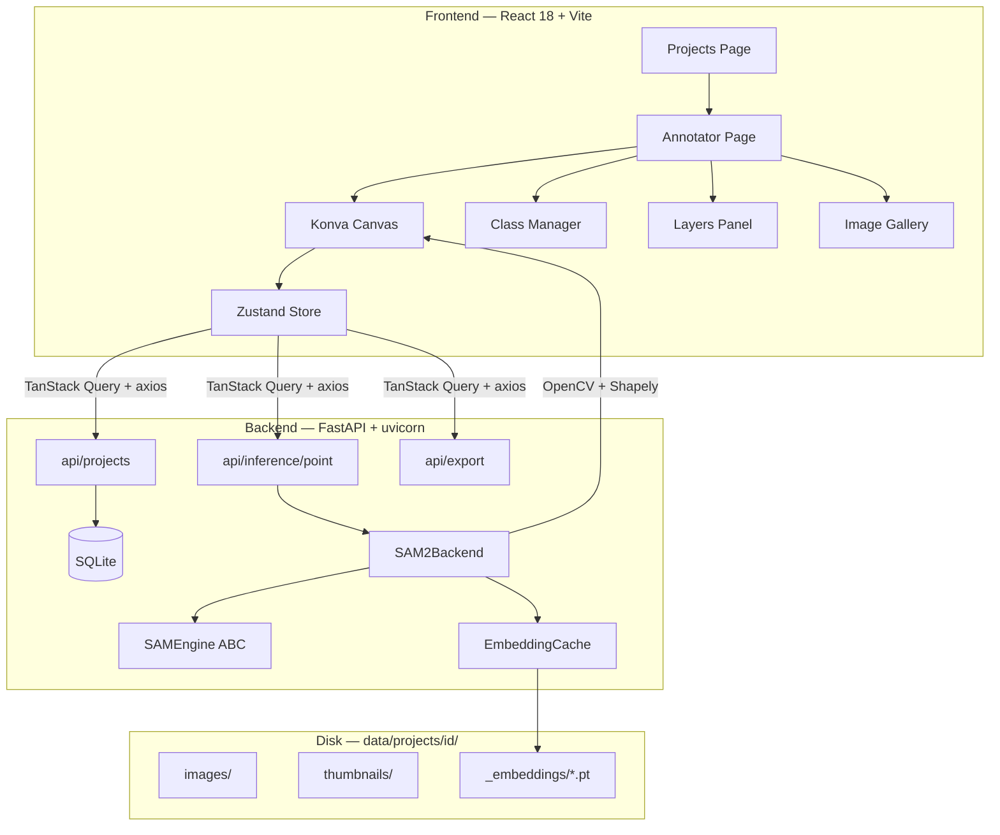

<div align="center">

# SAMark

**Local, privacy-first annotation platform powered by Segment Anything Model 2.1**

*A self-hosted alternative to Roboflow — no data leaves your machine.*

[](https://www.python.org/)
[](https://fastapi.tiangolo.com/)
[](https://react.dev/)
[](https://pytorch.org/)
[](https://github.com/facebookresearch/sam2)
[](LICENSE)
[](https://www.microsoft.com/windows)

---

> Annotate instance segmentation masks and bounding boxes at inference speed — one click per object, GPU-accelerated, embeddings cached on disk so every subsequent click is instant.

</div>

---

## Overview

SAMark brings the assisted-annotation workflow of commercial platforms into your local environment. It uses [SAM 2.1](https://github.com/facebookresearch/sam2) (Meta AI) as its segmentation backbone, wraps it in a FastAPI server with a three-level embedding cache, and exposes a Konva.js canvas frontend for fluid, keyboard-driven annotation.

Designed for computer vision practitioners who need to label custom datasets — particularly **multi-instance, multi-class** scenes — without uploading sensitive imagery to third-party services.

---

## Key Features

| Feature | Details |
|---|---|
| **SAM-assisted segmentation** | Left-click positive prompts, right-click negative prompts; mask preview updates on every click |
| **Three-level embedding cache** | In-memory → disk (`.pt`) → fresh encode; avoids recomputing the image encoder on repeat visits |
| **Bounding box tool** | Manual drag-to-draw boxes with an optional SAM constraint region |
| **Negative box tool** | Draw exclusion rectangles that are densely sampled into SAM negative prompts |
| **Polygon editing** | Drag vertices, click midpoints to insert, right-click to delete — all on the Konva canvas |
| **Box editing** | Eight-handle resize for confirmed bounding boxes |
| **Class management** | Named classes with hex color picker and drag-and-drop YOLO index reordering |
| **Export pipeline** | YOLO-seg, YOLO-det, COCO JSON — configurable train/val/test splits |
| **Fully local** | Zero telemetry, zero cloud dependency; all data stored in a portable project folder |

---

## Architecture



---

## Quick Start

> **Prerequisites:** Anaconda, NVIDIA GPU (≥ 4 GB VRAM), CUDA 12.x driver.
> Full installation guide in [`INSTALL.md`](INSTALL.md).

```bash
# 1. Clone
git clone https://github.com/<your-username>/samark.git
cd samark

# 2. Create the Python environment and install dependencies
conda create -n sam_studio python=3.11 -y
conda activate sam_studio
pip install torch==2.11.0+cu128 torchvision==0.26.0+cu128 --index-url https://download.pytorch.org/whl/cu128
pip install git+https://github.com/facebookresearch/sam2.git
pip install -r backend/requirements.txt

# 3. Install frontend dependencies (Node.js required)
cd frontend && npm install && cd ..

# 4. Download SAM 2.1 tiny checkpoint
#    Place sam2.1_hiera_tiny.pt in the directory set by MODELS_DIR in backend/app/config.py

# 5. Launch
start.bat        # Windows — opens browser automatically
```

---

## Annotation Workflow

```
Open project  →  Upload images (drag & drop)  →  Create classes  →  Annotate  →  Export
```

### SAM segmentation mode (`E`)

1. Select the active class (`1`–`9`).
2. **Left-click** on the object — SAM computes the image embedding on the first click (~1–2 s, cached for all subsequent clicks) and returns a mask preview in ~300 ms.
3. Add more positive clicks to expand the mask; **right-click** to place a negative prompt and exclude regions.
4. Press **Enter** to confirm the instance. It is written to SQLite immediately — no manual save step.
5. Press **Escape** to discard and start over.

### Bounding box mode (`B`)

Drag to draw a box. Press **Enter** to confirm. Double-click any confirmed box to enter resize mode.

### Polygon editing

Double-click any confirmed polygon. Drag vertices to reshape; click midpoints to insert new vertices; right-click a vertex to delete it (minimum 3 vertices enforced).

---

## Keyboard Reference

| Key | Action |
|---|---|
| `E` | SAM segmentation tool |
| `B` | Bounding box tool |
| `H` | Pan tool |
| `X` | Negative box tool (exclusion region) |
| `1` – `9` | Select class by index |
| `Space` | Next image |
| `Shift + Space` | Previous image |
| `Enter` | Confirm annotation / save edit |
| `Escape` | Cancel annotation / cancel edit |
| `Delete` / `Backspace` | Delete selected annotation |
| `Ctrl + Z` / `←` | Undo last SAM prompt point |
| Scroll wheel | Zoom (centered on cursor) |
| Drag (Pan tool) | Pan |

---

## Export Formats

All exports download as a `.zip` containing images, labels and metadata, split into `train/`, `val/`, and `test/` sets (default 70 / 20 / 10).

| Format | Output | Use case |
|---|---|---|
| **YOLO-seg** | Normalized polygon `.txt` + `data.yaml` | Instance segmentation training (YOLOv8/v11) |
| **YOLO-det** | `cx cy w h` `.txt` + `data.yaml` | Object detection training |
| **COCO JSON** | `instances_*.json` per split | Any COCO-compatible framework |

---

## Configuration

`backend/.env` — only non-default values need to be set:

```env
# Polygon simplification tolerance in pixels (higher = fewer vertices, faster export)
POLYGON_TOLERANCE=10.0

# Override the models directory if your checkpoints live elsewhere
# MODELS_DIR=C:\path\to\your\models
```

The SAM model variant is intentionally hardcoded to **tiny** in `backend/app/config.py` to stay within the 4 GB VRAM budget of laptop-class GPUs. Edit `SAM_CHECKPOINT` and `SAM_CONFIG` there if you have more VRAM available.

---

## Project Structure

```
samark/
├── backend/
│   ├── app/
│   │   ├── api/            # FastAPI routers (projects, classes, images, annotations, inference, export)
│   │   ├── core/
│   │   │   ├── sam_engine.py       # Abstract SAMEngine interface
│   │   │   ├── sam2_backend.py     # SAM 2.1 implementation with embedding cache
│   │   │   ├── embedding_cache.py  # Three-level cache (memory → disk → encode)
│   │   │   ├── mask_utils.py       # mask → polygon, simplify, normalize, bbox
│   │   │   └── exporters/          # YOLOSeg, YOLODet, COCO exporters
│   │   ├── db/             # SQLModel models + session
│   │   ├── schemas/        # Pydantic request/response schemas
│   │   ├── config.py       # Settings (pydantic-settings, .env aware)
│   │   └── main.py         # App factory, lifespan, CORS
│   └── requirements.txt
├── frontend/
│   └── src/
│       ├── components/     # Canvas, ClassManager, LayersPanel, ImageGallery, ...
│       ├── pages/          # Projects, Annotator
│       ├── store/          # Zustand global state
│       └── api/            # Axios wrappers
├── data/
│   └── projects/           # Runtime — gitignored
├── INSTALL.md
├── start.bat               # One-click launcher (Windows)
└── Makefile
```

---

---

## Contributing

Contributions, issues and feature requests are welcome. Please open an issue before submitting a pull request so we can discuss the approach.

This project is in active development and I am genuinely open to any form of feedback — whether that is an architectural suggestion, a workflow improvement, a bug report, or a perspective from practitioners working with different datasets or domain requirements. If you have used SAMark in your own annotation pipeline and encountered friction, I would particularly value hearing about it.

Do not hesitate to open an issue simply to share an idea, even if it is not yet fully formed. Constructive criticism is as welcome as praise.

```bash
# Run backend in development mode
conda activate sam_studio
cd backend
uvicorn app.main:app --reload

# Run frontend in development mode
cd frontend
npm run dev
```

---

## License

Distributed under the [MIT License](LICENSE).

SAM 2.1 is distributed by Meta AI under the [Apache 2.0 License](https://github.com/facebookresearch/sam2/blob/main/LICENSE).

---

<div align="center">
Built for computer vision practitioners who value data privacy and workflow speed.
</div>
